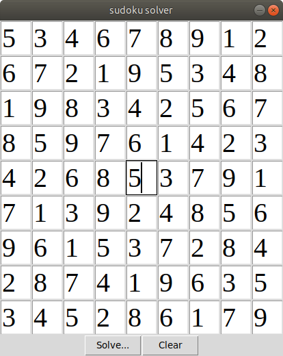

# sudoku-solver
Sudoku script based on tkinter library and the concept of recursion and backtracking.

## Installing
#### You will need:
- python 3.6.9
- python3-tk

Clone the project in a virtual environment, then:

```bash
pip install -r requirements.txt
```
---
## Usage
Start the script with:
```bash
python3 main.py
```
Yuo have those buttons:
- Press the `Clear` button to clear the window.
- Press the `Check input` button to know if the input presents any errors. This does not mean the input  will lead to a solution.
- Press the `Solve` button to show the solution of the current input. Maybe, for some input, there will be no solution because of a forced combination of numbers.
---
## Screenshot

