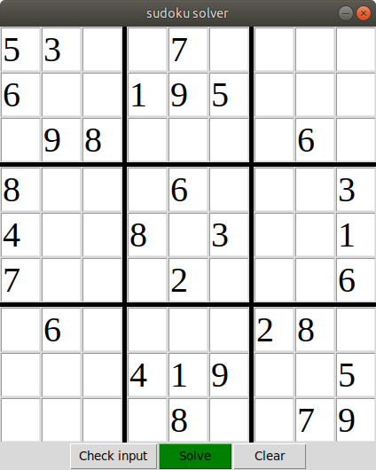

# sudoku-solver
Sudoku script based on tkinter library and the concept of recursion and backtracking.

## Installing
#### You will need:
- python 3.6.9
- python3-tk

Clone the project in a virtual environment, then:

```bash
pip install -r requirements.txt
```
---
## Usage
Start the script with:
```bash
python3 main.py
```
---
## Screenshot

